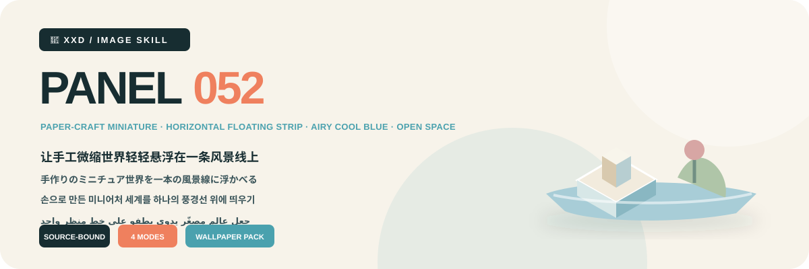
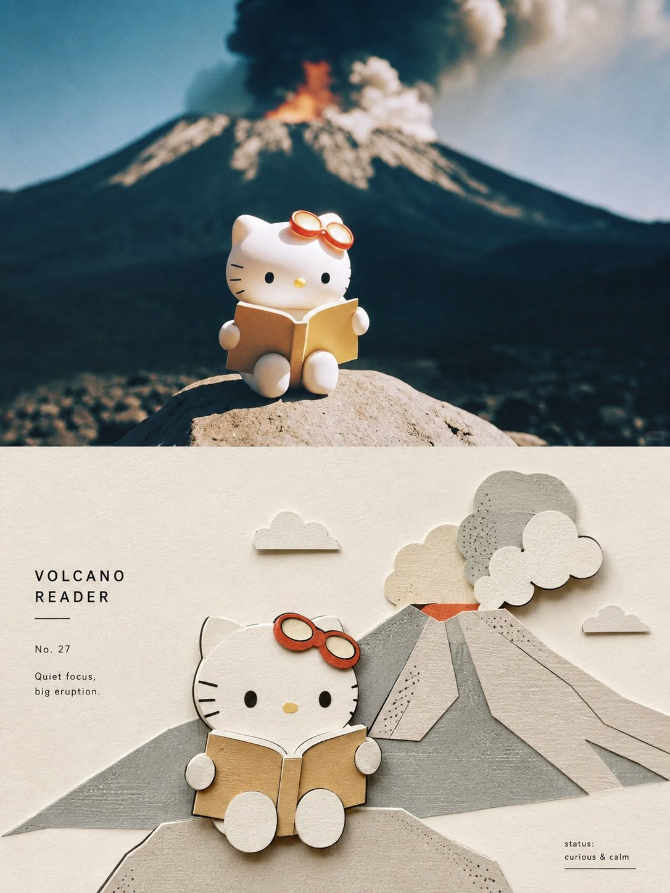
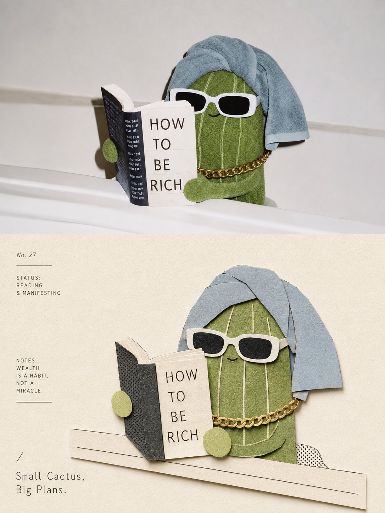
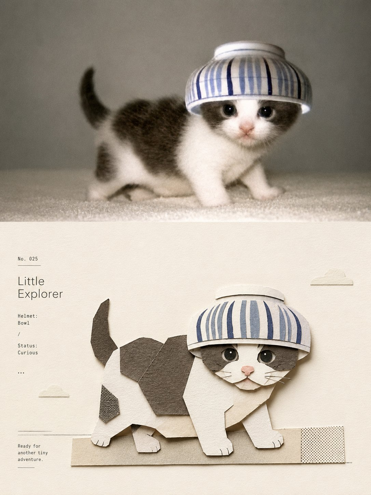
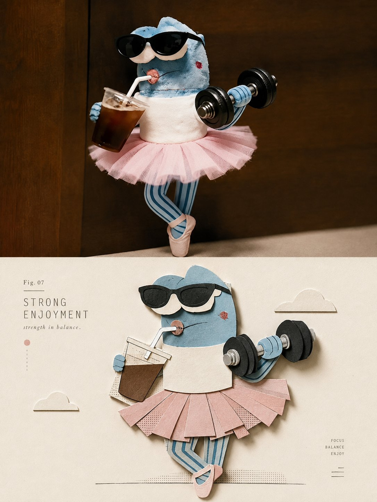

<p align="center"></p>

<div align="center">

# 🦁 XXD Panel 052

### 让手工微缩世界轻轻悬浮在一条风景线上

[](./SKILL.md)
[](#)
[](#)

<strong>简体中文</strong> 纸艺微缩 · 横向浮岛 · 真实手作 · 空气感冷蓝 · 大量留白

把源照片中最具识别度的主体和少量有依据的环境元素，重构为坐落于修长横向悬浮景观带上的纸、卡纸、软陶与薄木微缩模型；真实手作细节、微距光影与大面积浅色留白共同形成高级艺术装置感。

## 为什么需要这套 Skill

这套风格依赖每一张源图，不是可替换内容的装饰预设。它遵循这条重构链：

```text
锁定身份、剪影、姿态、方向与关系 → 保留三个线索 → 选择一个主角与少量有依据的辅助元素 → 重构为纸、卡纸、软陶和薄木微缩模型 → 放在一条修长横向悬浮景观带上 → 建立尺度纵深、层叠遮挡与安静平衡 → 用微距光影表现真实手作 → 保留空气感冷蓝与大量留白 → 放入一个签名般短标题
```

如果换成无关照片后，辨识度、模型构造、辅助元素、浮岛轮廓、材料、平衡、配色、留白与文案不发生实质变化，结果就不属于这套 Panel。

## 视觉契约

- 至少保留三个源图专属的剪影、比例、姿态、方向、动作、结构、颜色、材质或关系线索。
- 建立一个最重的主角与少量真正有依据的辅助模型，全部坐落在一条长、窄、轻盈的横向悬浮景观带上。
- 通过尺度差、层叠遮挡和更安静的前后景建立纵深；大致居中但不机械对称，辅助元素不得形成第二中心。
- 明确表现纸纤维、折边、切痕、层叠厚度、粗糙边缘和细小手工不完美，拒绝光滑塑料 CGI。
- 以空气感冷蓝、象牙白、浅米色、柔和灰绿与少量灰粉组织，并用柔和微距光线和大量浅色负空间保持轻盈。

原始审美约束与拒绝项只存在于[原始提示词](references/052-source.md)；Skill 与运行适配器只处理本次交付变量。 [Skill 工作流](SKILL.md) · [英文运行适配器](references/xxd-panel-052-prompt.en.md)

## 样张 · 来自 X

> [小小东（@xiaoxiaodong01）](https://x.com/xiaoxiaodong01/status/2091500926721020375) · 2026 年 8 月 23 日<br>
> GPT2 × 剪纸 × 素雅 × 美学提示词 × VOL.052

<table>
  <tr>
    <td width="50%"><a href="https://x.com/xiaoxiaodong01/status/2091500926721020375"></a></td>
    <td width="50%"><a href="https://x.com/xiaoxiaodong01/status/2091500926721020375"></a></td>
  </tr>
  <tr>
    <td width="50%"><a href="https://x.com/xiaoxiaodong01/status/2091500926721020375"></a></td>
    <td width="50%"><a href="https://x.com/xiaoxiaodong01/status/2091500926721020375"></a></td>
  </tr>
</table>

<p align="center"><a href="https://x.com/xiaoxiaodong01/status/2091500926721020375">查看原推文与完整提示词 →</a></p>

这些样张用于展示 052 的美学动机，不会把样张中的主体、构图、配色、文案或旧画幅变成生成参考或当前默认值。

## 原始提示词优先，而不是二次导演

`references/052-source.md` 是本项目唯一的创作与审美权威。Skill 不再额外总结或扩写它，也不会统一规划颜色、色板、美学动机、标题或微文案。原始提示词要求怎样处理颜色、材料、构图、留白与文字，GPT Image 2 就按那套逻辑执行。

模式与尺寸会完整替换原始提示词旧有的 3:4 上下交付容器，但不改写它的转译美学。每张成品只向 GPT Image 2 发送一个已选模式的最终契约，不再把四种模式放进同一个通用模板让模型自行猜测。

## 四种可组合输出模式

模式可以单选或多选：`top-bottom`、`left-right`、`design-only`、`wallpaper-pack`；多选时，每个模式分别生成、分别拥有自己的提示词。

- `top-bottom`：整张画面由上方现实画面与下方设计转译两个主要部分组成。
- `left-right`：整张画面从顶部到底部保持完整左右结构，原图在左、设计在右；文字融入这两个区域，不再生成横跨全宽的第三块底栏。左右宽度可以不对称，由模型自主构图。
- `design-only`：原图只作为不可见的身份、结构、颜色与事实依据；整张成品的每个可见元素都必须属于该 Skill 自己的设计转译语言。
- `wallpaper-pack`：每台设备分别生成完整画布的设计转译壁纸，原图不作为照片区域出现。

上下或左右都不做分界线、中线百分比或像素坐标检测。只有用户明确要求像素级分区或原片逐像素不变时，才使用确定性拼合。

普通成品尺寸同样可以多选：自动适配、跟随原图、1:1、3:4、4:3、4:5、5:4、2:3、3:2、9:16、16:9、21:9、5:7、7:5，或自定义比例／准确像素。没有静默默认尺寸；每个不同比例都会基于同一份原始提示词独立重构。

壁纸套装可选“连贯”或“四张独立”。连贯模式先生成一张定调图，其余设备同时参考原图与定调图重新构图；不会把一张图机械裁成四种尺寸。

## 文字方式

正式生图前只确认三种选择：

1. **模型根据原始提示词生成文字**：用户只指定语言或地区，文字内容、数量、气质与排版由 GPT Image 2 按原始提示词生成；所有文字都从当前图片的内容、气质或隐喻中自然生长，任何事实或资料式信息都必须有用户输入、图片可见内容或已核实信息作为依据。
2. **使用我的准确文字**：逐字传给图像模型，不改写、不翻译、不补标题；排版仍遵循原始提示词。
3. **不要文字**：严格禁止文字与伪文字。

外层 Skill 不再预编标题、微文案或文案包。文字语言与操作语言分开确认，不根据人物、场景或文件名猜测国家与受众。

## 完整画布优先与位图边界

图像模型负责整张成品的审美重构，双联也默认一次直出完整画布。`scripts/compose_panel.py` 只保留为条件明确的兜底、无创尺寸校准和只读审计工具，不再预先规划每次任务，也不评价审美是否成功。

全部交付为 PNG 位图。每次调用都在 `~/Desktop/xxd/` 下创建新任务；已配置图像通道只返回脱敏状态，不公开供应商、端点、凭据、请求头、提示词、响应或账户信息。SVG、HTML、Canvas、图表和程序绘图不能替代最终作品。

## 能力自适应问询与快捷参数

同一个 Skill 会根据宿主真正提供的交互能力选择界面，不会把文本符号伪装成可点击控件：

- **Claude Code 提供 `AskUserQuestion + multiSelect: true` 时**：模式和尺寸使用真正的 checkbox；文字方式与壁纸关系使用单选。常用尺寸会按方形、竖版、横版分组展示，并累计多组选项；自定义尺寸进入自由输入。
- **Codex 只提供 `request_user_input` 时**：它只用于文字方式、壁纸关系等互斥单选，不拿来伪装模式或尺寸多选。模式与尺寸改用清楚的组合输入。
- **没有交互工具时**：使用两轮文字问询。第一轮选择一个或多个模式；第二轮填写尺寸与文字方式。Skill 不显示假的 `- [ ]`，也不会为了获得表单要求用户切换 Plan mode。

默认第二轮只展示“智能推荐／跟随原图／常用比例／自定义”四个入口；只有选择常用比例时，才展开完整比例库：方形 `1:1`，竖版 `3:4、4:5、2:3、9:16、5:7`，横版 `4:3、5:4、3:2、16:9、21:9、7:5`。所有比例都可组合，也可直接输入准确像素。

全部设置都可以直接作为参数传入：

```text
/xxd-panel-052 photo.jpg --mode top-bottom,design-only --size auto,3:4,9:16 --text prompt --locale ja-JP
```

支持 `--mode`、可重复或逗号分隔的 `--size`、`--text prompt|exact|none`、`--locale`、`--copy`、`--wallpaper linked|independent`、`--wallpaper-size` 和 `--out`。参数齐全时跳过全部问询；参数不完整时只询问缺失项。

## 生图模型优先级

GPT Image 2 是默认首选，并继续执行本项目现有的高保真垫图、生成前确认整张画幅、双联一次生成完整画布、脚本仅作条件式兜底等逻辑。

当当前工具或已配置兼容通道确实可用，并能满足原图保真、整张成品比例、目标语言文字和连贯壁纸多图参考等要求时，也支持 Seedance 5.0 Pro、Nano Banana Pro（Gemini Image Pro）、Nano Banana 2（Gemini Image Flash）或其他兼容位图模型。备用模型只替换生成通道，不得改变模式、画幅、文案、语言、壁纸关系和完整画布优先策略。

如果没有合适的生图通道，Skill 会请用户启用生图工具或提供 API Key。用户主动提供的凭据可以用于当前任务，但不得在回复或日志中回显、展示或泄露；未经用户明确要求，不会长期保存凭据或修改供应商、账户、计费及全局路由配置。

## 开始使用

```bash
git clone https://github.com/nevertoday/xxd-panel-052.git
mkdir -p ~/.codex/skills
ln -s "$(pwd)/xxd-panel-052" ~/.codex/skills/xxd-panel-052
```

Claude Code 用户可把同一文件夹链接到 `~/.claude/skills/xxd-panel-052`. 安装后请重启 Agent 会话。

```text
$xxd-panel-052
Use this photograph, ask me for the modes and copy setting, then generate fresh raster outputs.
```

完整规格: [Skill 工作流](SKILL.md) · [原始风格档案](references/052-source.md) · [英文运行适配器](references/xxd-panel-052-prompt.en.md) · [中文运行适配器](references/xxd-panel-052-prompt.zh-CN.md)

## 关于 XXD

XXD 是小小东品牌名的缩写，本项目由小小东创建并维护： [@xiaoxiaodong01](https://x.com/xiaoxiaodong01).

## 支持与会员

### 深度咨询 · 299 元／小时

一对一深入咨询 Skills 的使用与工作流，通过微信联系小小东预约。 [WeChat](https://xiaoxiaodong.pages.dev/assets/wechat-qr.png)

### 小小东 Skills 用户交流群 · 99 元

一次付费加入 Skills 用户交流群，用于工作流分享和用户间讨论；不包含按小时计费的一对一咨询。

### 知识星球＋成员提示词库 · 699 元／年

知识星球和成员提示词库是一份 699 元／年的会员费用，一次年费同时开通两项权益：若从知识星球开通，请微信联系小小东领取成员提示词库兑换码；若在成员提示词库自助开通，请微信联系小小东邀请进入知识星球。

[Knowledge Planet](https://wx.zsxq.com/group/15554814142882) · [Member Prompt Library](https://vip.xiaoxiaodong.ai/)

<p align="center"><a href="https://xiaoxiaodong.pages.dev/assets/wechat-qr.png"></a></p>

<div align="center"><strong>让一条轻盈的风景带，托住照片里最值得记住的日常。</strong></div>

---

<div align="center">

## ☕ 支持这个开源项目

算力赞助请使用小小东自己的微信或支付宝赞赏码；赞助完全自愿，不改变开源项目的访问权限。


<table><tr>
<td align="center"><a href="https://colors.xiaoxiaodong.ai/docs/images/wechat-reward-qr.png"></a><br><strong>WeChat</strong></td>
<td align="center"><a href="https://colors.xiaoxiaodong.ai/docs/images/alipay-reward-qr.png"></a><br><strong>Alipay</strong></td>
</tr></table>

</div>
</div>
